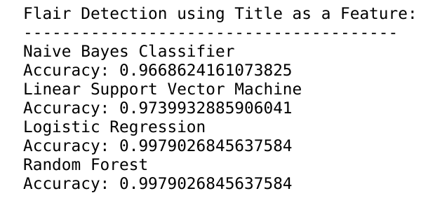
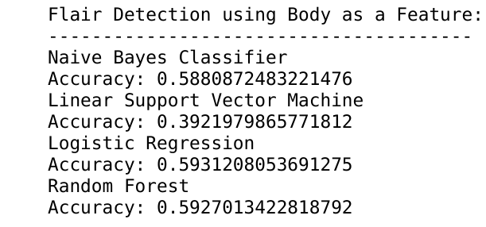

<p align="center">
  
</p>
<h4 align="center">Reddit Flair Detection Web Application for r/india.</h4>

<br>

<p align="center">   
  <a href="https://github.com/imskr/reFlare/blob/master/LICENSE">
    
  </a>
  
  <a href="https://github.com/imskr/reFlare/stargazers">
    
  </a>

 <a href="https://github.com/imskr">
    
  </a>
</p>

<p align="center">
  <sub>Created by <a href="https://github.com/imskr"><strong>Shubham Kumar</strong></a>
</p>
<hr noshade>

## Local Set-up

* **Linux**
  ```bash
  $ git clone https://github.com/imskr/reflair.git
  $ cd reflair
  $ python3 -m venv env_name
  $ source env_name/bin/activate
  $ pip3 install -r requirements.txt
  $ python3 app.py
  ```

`Go to http://127.0.0.1:5000 to test your app`

*Note: If you have `fish` terminal run `$ source env_name/bin/activate.fish`*
* **Windows**
  ```bash
  $ git clone https://github.com/imskr/reflair.git
  $ cd reflair
  $ python3 -m venv env_name
  $ source env_name/bin/activate
  $ pip3 install -r requirements.txt
  $ python3 app.py
  ```

`Go to http://localhost:5000 to test your app`

## Data (r/india)
* **Data fetched using `PRAW` reddit API**.
* **Flairs supporting (currently 11)**
  
  | Label | Flair              | Samples       | After Cleaning     |  
  | ---   | ---                | ---           | ---                |
  | 1.    | AskIndia           | 11            | 11                 |
  | 2.    | Business/Finance   | 458           | 458                |
  | 3.    | CAA-NRC-NPR        | 11            | 11                 |
  | 4.    | Food               | 121           | 121                |
  | 5.    | Non-Political      | 1322          | 1322               |
  | 6.    | Policy/Economy     | 165           | 165                |
  | 7.    | Politics           | 124           | 124                |
  | 8.    | Scheduled          | 369           | 369                |
  | 9.    | Science/Technology | 11            | 11                 |
  | 10.   | Coronavirus        | 88            | 88                 |
  | 11.   | Sports             | 3             | 03                 |
  | 12.   | Photography        |               |                    |
  | 13.   | TIL                |               |                    |
  | 14.   | Unverified         |               |                    |
  | 15.   | na                 |               |                    |


* **Distribution Graph**
<br>

  


## Training Algorithms

* **Title as Feature**
  

* **Body as Feature**
  

* **Title+Body+URL as Feature**
  
  
## References
* [Scrap Reddit Data](https://www.storybench.org/how-to-scrape-reddit-with-python/)
* [PRAW: Docs](https://praw.readthedocs.io/en/latest/)